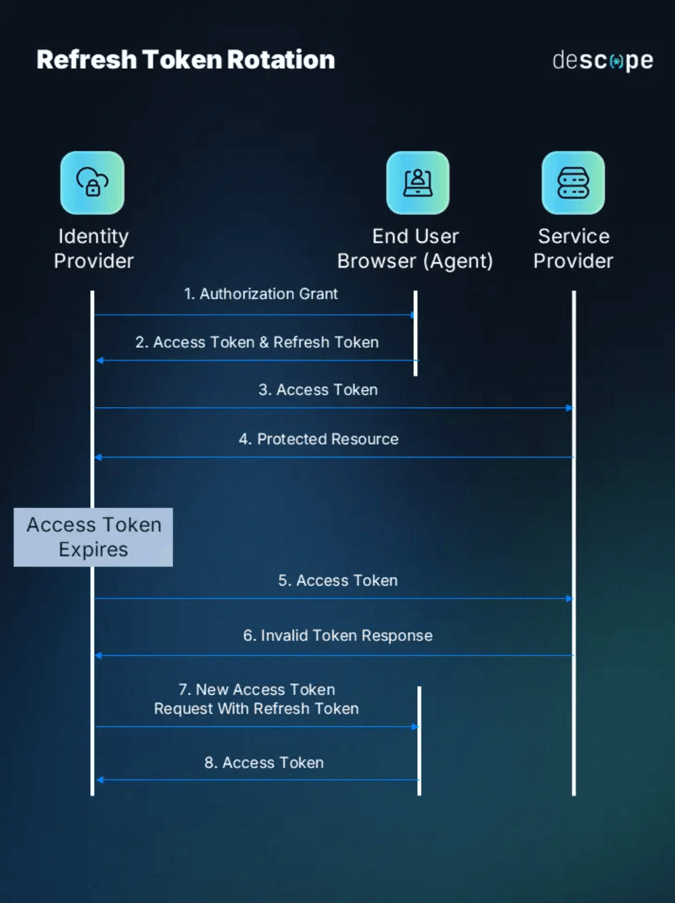

# **Web Develop BackEnd Template**

<div align="center">
    
</div>

Código fuente para practicar el método de autenticación **Refresh Token** con TypeScript. 🏆

## ✅ **Guía de Instalación**

Para realizar el montaje de esta aplicación para avances en su desarrollo, siga los siguientes pasos:

1. ✨ **Abrir una ventana terminal**.

2. ✨ **Verifique si cuenta con Node JS instalado:**

    ```sh
    node -v
    ```

    > **NOTA**: En caso de no contar con el entorno de ejecución de Javascript, Node JS, acceda al siguiente enlace para su instalación o actualización:
    > https://nodejs.org/es
    > 
    > Una vez instalado, ejecute el comando anterior para determinar si se realizo la instalación.


3. ✨ **Clone el repositorio de `RefreshToken-TS`**:

    ```sh
    git clone <>
    ```

4. ✨ **Nos situamos en la raíz del proyecto**:

    ```sh
    cd "learn-refresh-token"
    ```

5. ✨ **Instalamos los módulos de Node JS**:

    ```sh
    npm install
    ```

6. ✨ **Abrir el proyecto en un editor de código**:

    > NOTA: Se recomienda que se utilice **[Visual Studio Code](https://code.visualstudio.com/download)**. 
    >
    > De tenerlo, use el comando **`code .`** para abrir el proyecto con VS Code.

## ⚙️ **Configuración de Variables de Entorno**

Una vez montado el proyecto procederemos a ejecutar la aplicación, pero antes de eso, se deben configurar las variables de entorno correspondientes. A continuación, se describirán los pasos para configurar las variables de entorno de la aplicación:

1. ✨ **Ubique y abra el archivo llamado `.env-example`.**

2. ✨ **Copie y pegue en la raíz del proyecto dicho archivo.**

3. ✨ **Renombre el archivo copiado por `.env`.**

4. ✨ **En el contenido, ingrese lo siguiente:** 

    ```sh
    ```

5. **✨ Especifique los valores correspondientes en las variables de entorno**-

6. ✨ **Guarde los cambios y será todo.**

## 💚 **Iniciar Servidor**

Una vez configurado lo anterior, ya puedes ejecutar el servidor. Para eso, ejecuta el comando:

```sh
npm run dev
```

La consola, debería regresar una respuesta como esta:

```sh

```

## 🧠 **Acerca De**

Los tokens web JSON (JWT) son un método popular de autenticación que permite la transmisión segura de información entre partes como un objeto JSON. En este artículo, profundizaremos en los detalles de la autenticación JWT en una aplicación Node.js y exploraremos el uso de tokens de actualización para prolongar la vida útil de nuestros JWT.

<div align="center">
    
</div>

Un JWT es un objeto JSON compacto y autónomo que contiene información sobre la autenticación de un usuario. Esta información se puede verificar y es confiable gracias a su firma digital mediante una clave secreta. Los componentes principales de un JWT son:

1. **Encabezado**: contiene información sobre cómo se codifica el JWT, como el algoritmo utilizado para firmar el token.
2. **Carga útil**: Contiene las reclamaciones. Las reclamaciones son declaraciones sobre una entidad (normalmente, el usuario) y metadatos adicionales. Existen tres tipos de reclamaciones: registradas, públicas y privadas.
3. **Firma**: Se utiliza para verificar que el remitente del JWT es quien dice ser y para garantizar que el mensaje no haya sido modificado durante el envío. La firma se crea tomando el encabezado codificado, la carga útil codificada y una clave secreta, y luego firmándolos con un algoritmo específico.

## 🔍 **Referencias**

- ✨ **[JWT Authentication in Nodejs — Refresh JWT with Cookie-based Token](https://medium.com/@techsuneel99/jwt-authentication-in-nodejs-refresh-jwt-with-cookie-based-token-37348ff685bf)**

- ✨ **[Refresh token con autenticación JWT: implementación en Node.js](https://www.izertis.com/es/-/blog/refresh-token-con-autenticacion-jwt-implementacion-en-node-js)**

- ✨ **[JWT & Refresh Tokens 🔒](https://dev.to/jeanvittory/jwt-refresh-tokens-2g3d)**

- ✨ **[The Developer’s Guide to Refresh Token Rotation](https://www.descope.com/blog/post/refresh-token-rotation)**

---
&copy; DanielGonzalez-Cistem, 2025.